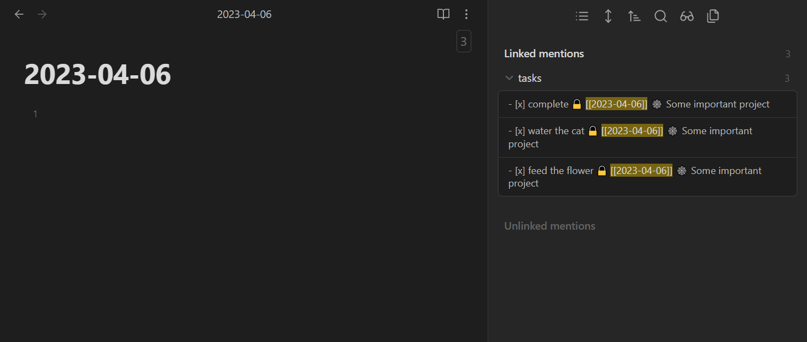
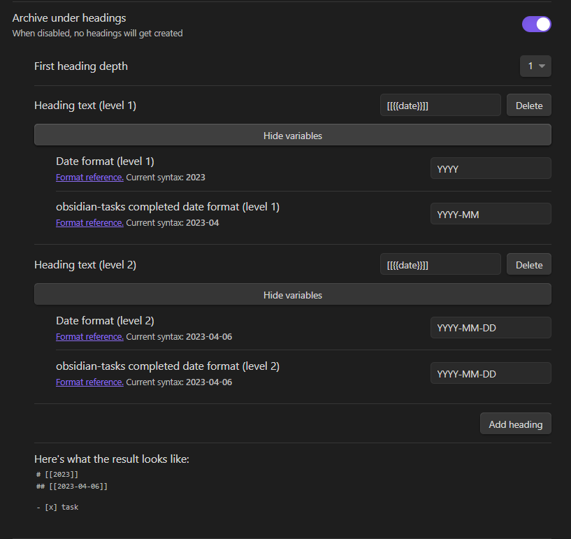
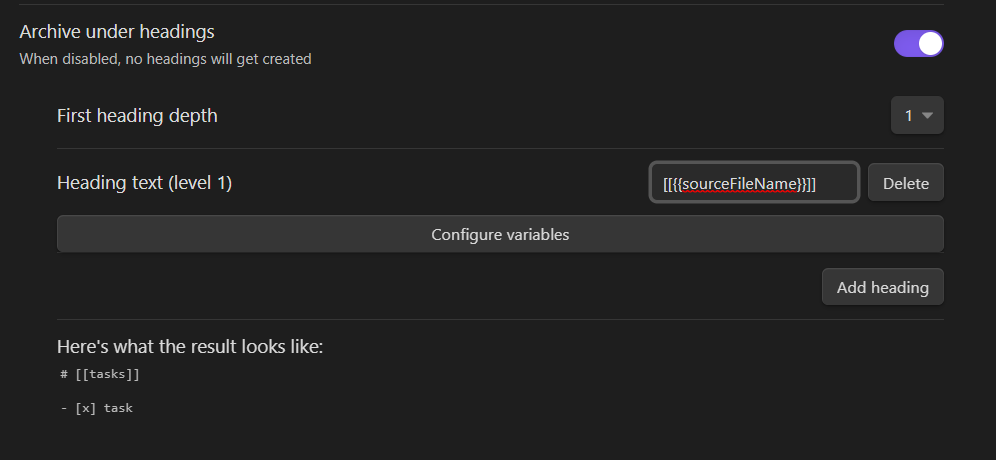
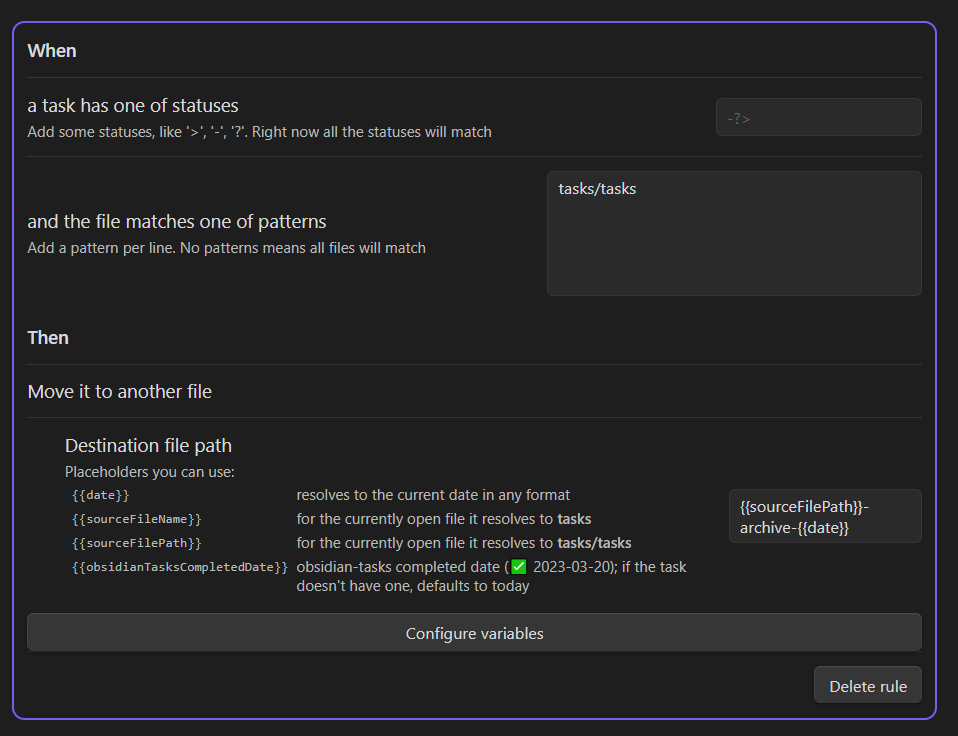

This plugin is a toolbox for working with completed tasks in your markdown files. It brings some
of [org-mode's](https://orgmode.org/) features to Obsidian.

## Contribution

If you noticed a bug or thought of some way to improve the plugin, feel free to create an issue: https://github.com/ivan-lednev/obsidian-task-archiver/issues.

Pull-requests are also welcome! If you want to contribute but don't know where to start, you can create an issue or write me an email: <bishop1860@gmail.com>.

You can also support me by buying me a coffee:

<a href="https://www.buymeacoffee.com/machineelf" target="_blank"></a>

## Commands <a id="commands"></a>

<details>
<summary>Archive tasks in this file</summary>

Here is what it looks like:

```md
-   [ ] This one I haven't done yet
-   [x] Water the dog
    -   Some task details
-   [x] Feed the plants
```

Turns into:

```md
-   [ ] This one I haven't done yet

# Archived

-   [x] Water the dog
    -   Some task details
-   [x] Feed the plants
```

Or, with date tree enabled:

```md
-   [ ] This one I haven't done yet

# Archived

-   [[2021-09-W-38]]
    -   [[2021-09-16]]
        -   [x] Water the dog
            -   Some task details
        -   [x] Feed the plants
```

</details>
<details>
<summary>Archive tasks including nested tasks in this file</summary>

Same as simple archiving, except that now completed nested tasks also get archived, with their sub-items.

This:

```markdown
-   [ ] Incomplete task
    -   [x] Completed subtask
        -   Task details
    -   [ ] Incomplete subtask
```

Turns into:

```markdown
-   [ ] Incomplete task
    -   [ ] Incomplete subtask

# Archived

-   [x] Completed subtask
    -   Task details
```

</details>

<details>
<summary>Delete tasks in this file</summary>

This one is the same as 'Archive tasks in this file', except that the tasks get discarded.

</details>

<details>
<summary>Archive heading under cursor</summary>

Grab the whole section under the heading under cursor, including all the child sections and move it to the archive.

This:

```markdown
Some top-level text

# H1 heading

Some text

## H2 heading

More text
```

Turns into:

```markdown
Some top-level text

# Archived

## H1 heading

Some text

### H2 heading

More text
```

</details>

<details>
<summary>Sort tasks in list under cursor</summary>

Grab the whole list under cursor and **recursively** reorder all the items based on completeness:

1. Plain list items first
2. Then, incomplete tasks
3. And finally, completed tasks

This list:

```markdown
-   [x] Task
-   Item
-   [ ] Incomplete
    -   [x] Task
    -   Item More notes
    -   [ ] Incomplete
-   Item 2
-   [ ] Incomplete 2
    -   [x] Task
    -   Item
    -   [x] Task 2
```

Turns into:

```markdown
-   Item
-   Item 2
-   [ ] Incomplete
    -   Item More notes
    -   [ ] Incomplete
    -   [x] Task
-   [ ] Incomplete 2
    -   Item
    -   [x] Task
    -   [x] Task 2
-   [x] Task
```

</details>

<details>
<summary>Turn list items at this level into headings</summary>

Grab the list under cursor and turn every list item at and above the level of the item under cursor into a heading.

This:

```markdown
-   li 1
    -   li 2 | <- cursor
        -   li 3
```

Turns into:

```markdown
# li 1

## li 2

-   li 3
```

</details>

<details>
<summary>Toggle task under cursor done and archive it</summary>

When the cursor is on a task, this command completes the task and archives it at once.

</details>

## Settings

There are a lot of settings to help you build a suitable workflow.

### Placeholders

You can use several placeholders throughout the settings to build cool workflows. Those get resolved to different values when you run the archiver:

-   `{{date}}`
    -   Points to today
-   `{{obsidianTasksCompletedDate}}`
    -   Points to the completed date on the task (✅ 2023-03-29). This way you can archive tasks created with the `obsidian-tasks` plugin where they belong
-   `{{sourceFileName}}`
    -   Resolves to the base name of the file you're in
-   `{{sourceFilePath}}`
    -   Resolves to the path from the root of the vault to the file you're in
-   `{{heading}}`
    -   Points to the heading above the task
-   `{{headingChain}}`)
    -   Creates a chain from headings above the task. E.g. `Project 1 > Team 2`

### Archive file path

You can send tasks to the same file or to a separate file, say, to a daily note, or to some path based on the name of the file you're in.

### Replacing text before archiving

A regular expression for replacing the contents of the task during archiving; this is useful if you want to strip tags from archived tasks.

### Append stuff before archiving

This might be useful if you want to see what you accomplished in a day:


### Additional patterns to detect completed tasks

This way you can archive only those tasks that match a pattern and leave the rest of them alone. Say, you only want to archive tasks with a global filter used by the `obsidian-tasks` plugin (like the tag `#task`).

### Heading & list hierarchies

You can create arbitrary hierarchies with placeholders both with headings and with list items. New archived tasks are going to be merged into existing trees.

You can use this feature to create a date tree in your archive:


Or you can create a single archive file with links to sources in headings:


### Rules

Rules allow you to treat tasks with different statuses differently (`[x]`, `[>]`, `[-]`) by sending them to different files:


Potentially rules can specify any custom workflow for any set of tasks that match certain conditions. If you'd like to see some additional functionality here, feel free to create a feature request!

## Usage

Open the command palette and run one of the archiver [commands](#commands).

## Acknowledgements

This plugin is an implementation of some features of [org-mode](https://orgmode.org/) for Emacs.

Also, I relied on the code from these excellent plugins:

-   [obsidian-kanban](https://github.com/mgmeyers/obsidian-kanban)
-   [obsidian-outliner](https://github.com/vslinko/obsidian-outliner). This plugin is a beauty in terms of architecture and code quality
-   [obsidian-commander](https://github.com/phibr0/obsidian-commander). Helped me figure out how to use a reactive framework to build a settings page

### Contributors

-   Richard Cook (wealthychef@gmail.com)

## Development

-   [Solid.js](https://www.solidjs.com/) is used for the settings page.
